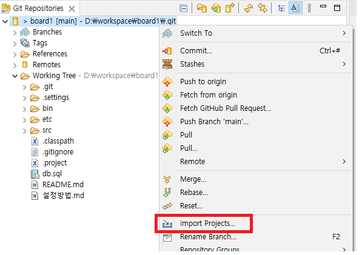
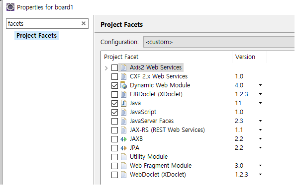

#### 서버 톰캣 설정  
Window > Preferences  
  
   
 

 

tomcat 설치한 폴더 선택 후 Finish  

Window > Show View > Servers에 설치한 서버가 보이는지 확인

#### Git & Project 설정 
Git Repositories
  
클릭  
   
git 주소 입력 후 Next Next  
   
설치 할 폴더 입력후 Finish
  
Project import 하면 project에 나타남  

Project 창에서 우클릭 Properties 창에서  
  
Dynamic Web Module 선택 후 Apply

